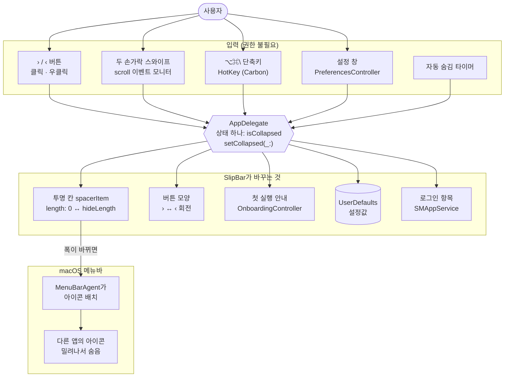
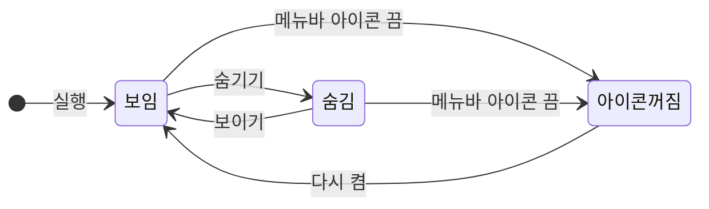
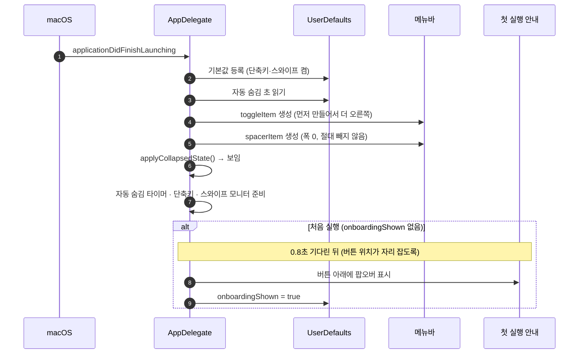
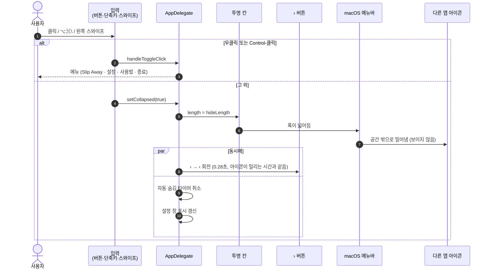
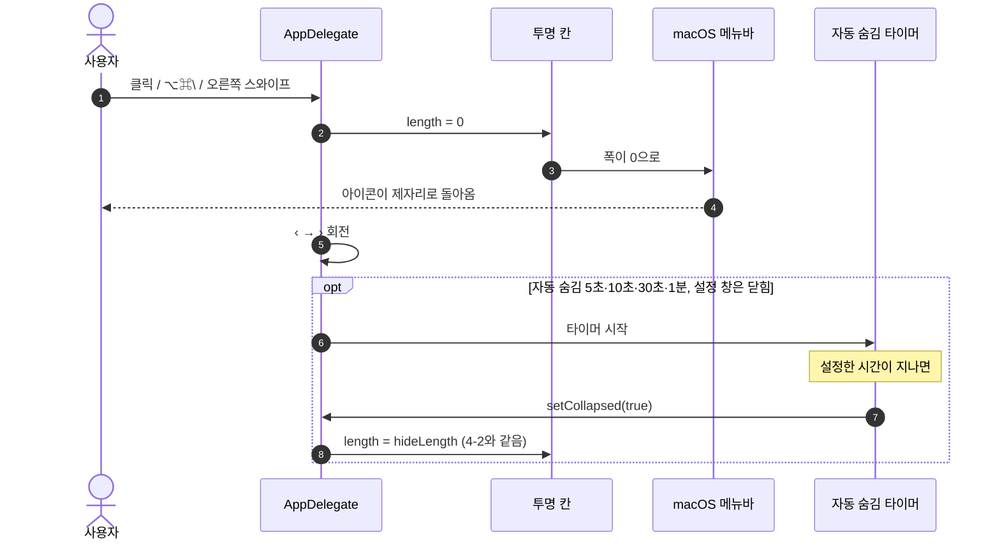
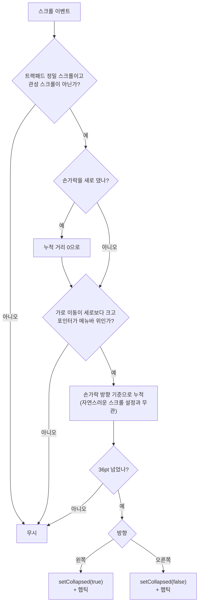
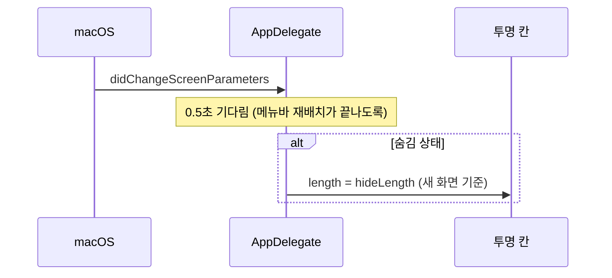
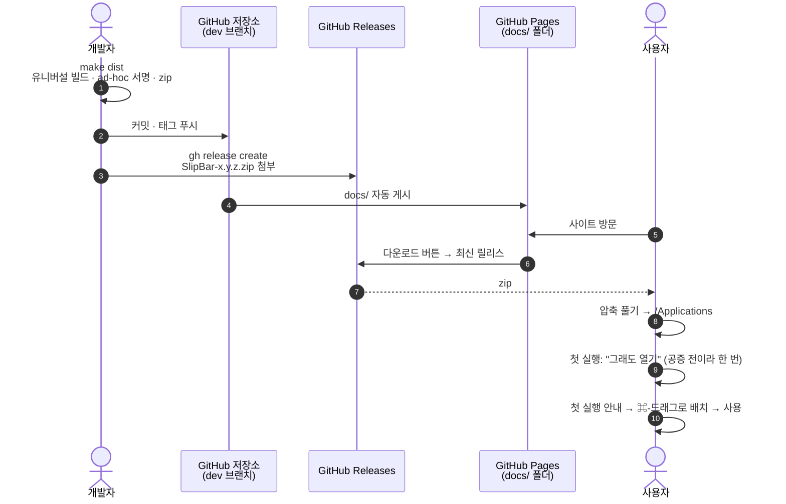

# SlipBar 구조와 흐름

SlipBar가 어떤 부품으로 이루어져 있고, 무슨 일이 어떤 순서로 일어나는지 그림으로 정리한 문서입니다.
코드는 [`Sources/main.swift`](Sources/main.swift) 한 파일이며, 아래 이름들은 모두 그 파일의 실제 타입·함수 이름입니다.

- [1. 한눈에 보기: 구성도](#1-한눈에-보기-구성도)
- [2. 메뉴바에서 일어나는 일](#2-메뉴바에서-일어나는-일)
- [3. 상태](#3-상태)
- [4. 시간 흐름](#4-시간-흐름)
- [5. 배포 흐름](#5-배포-흐름)
- [6. 코드 지도](#6-코드-지도)

## 1. 한눈에 보기: 구성도

SlipBar는 권한 없이 동작하는 작은 백그라운드 앱입니다. 모든 입력은 `AppDelegate`로 모이고, `AppDelegate`는 메뉴바에 둔 두 개의 `NSStatusItem`(버튼과 투명 칸)만 바꿉니다. 다른 앱의 아이콘을 직접 건드리지 않습니다.

## 2. 메뉴바에서 일어나는 일

다른 앱의 아이콘을 숨기는 공개 API는 없습니다. 그래서 SlipBar는 버튼 바로 왼쪽에 **투명 칸(spacer)** 을 두고, 숨길 때 그 폭을 넓혀 왼쪽 아이콘들을 밀어냅니다.

**보일 때:** 투명 칸의 폭은 0입니다.

**숨길 때:** 투명 칸이 넓어지면, 공간이 모자란 왼쪽 아이콘들을 macOS가 메뉴바에서 빼냅니다. 빠진 아이콘은 앱 메뉴 뒤로 조용히 사라지고, 메뉴바에는 ‹ 버튼만 남습니다.

숨길 아이콘은 사용자가 직접 ⌘-드래그로 **› 왼쪽**에 둡니다. 어떤 아이콘을 숨길지는 순서로만 정해지고, SlipBar가 따로 기억하지 않습니다.

## 3. 상태

SlipBar의 핵심 상태는 `isCollapsed` 하나입니다. 어떤 입력이든 결국 `setCollapsed(_:)`를 부릅니다.

| 상태 | 투명 칸 | 버튼 | 자동 숨김 타이머 |
|------|---------|------|------------------|
| 보임 | 폭 0 | `›` | 켜져 있고 설정 창이 닫혀 있으면 돎 |
| 숨김 | 폭 `hideLength` | `‹` | 멈춤 |
| 아이콘꺼짐 | 메뉴바에서 뺌 | 메뉴바에서 뺌 | 멈춤 (단축키·스와이프도 꺼짐) |

- **숨기기:** 버튼 클릭, `⌥⌘\` 단축키, 메뉴바에서 왼쪽 스와이프, 설정의 Slip Away 스위치, 자동 숨김 타이머
- **보이기:** 버튼 클릭, `⌥⌘\` 단축키, 메뉴바에서 오른쪽 스와이프, 설정의 Slip Away 스위치
- **다시 켬:** 설정 창에서 메뉴바 아이콘을 켭니다. 아이콘이 꺼져 있을 때는 Finder에서 SlipBar를 다시 열면 설정 창이 뜹니다.

## 4. 시간 흐름

### 4-1. 앱 시작

### 4-2. 숨기기

클릭, 단축키, 스와이프, 설정 스위치, 자동 숨김 타이머가 모두 같은 길을 탑니다.

### 4-3. 보이기와 자동 숨김

### 4-4. 스와이프 판정

트랙패드 스크롤 이벤트 중 "메뉴바 위에서 옆으로 쓸기"만 골라냅니다. 권한이 필요 없는 이벤트 모니터를 씁니다.

### 4-5. 디스플레이가 바뀔 때

모니터를 연결하거나 해상도를 바꾸면 버튼이 있는 화면의 폭이 달라질 수 있으므로, 숨긴 상태라면 길이를 다시 계산합니다.

## 5. 배포 흐름

만드는 사람과 쓰는 사람 사이의 흐름입니다. 서버 없이 GitHub만 씁니다.

## 6. 코드 지도

`Sources/main.swift`의 구역(`// MARK:`)과 역할입니다.

| 구역 | 타입 · 함수 | 역할 |
|------|-------------|------|
| 진입점 | `enum Slip` · `main()` | Dock 없는 백그라운드 앱(`.accessory`)으로 실행 |
| App | `AppDelegate` | 상태(`isCollapsed`)와 모든 동작의 중심 |
| Menu bar | `installMenuBar()` · `applyCollapsedState()` · `hideLength` | 버튼·투명 칸 생성, 숨김 길이 계산과 적용 |
| Hot key & swipe | `updateHotKey()` · `updateSwipeMonitor()` · `handleScroll(_:)` | 단축키, 스와이프 판정 |
| Actions | `setCollapsed(_:)` · `handleToggleClick(_:)` · `presentMenu` | 숨김/보임, 클릭과 우클릭 메뉴 |
| Auto-collapse | `scheduleAutoCollapseIfNeeded()` | 자동 숨김 타이머 |
| Preferences | `PreferencesController` | 설정 창, `sync(from:)`로 상태 반영 |
| Onboarding | `OnboardingController` · `DemoBarView` | 첫 실행 팝오버와 움직이는 미니 메뉴바 |
| Hot key | `HotKey` | Carbon `RegisterEventHotKey` 래퍼 (권한 불필요) |
| Icons | `Icons.glyph(progress:)` | 흐린 막대와 꺾쇠를 그리고, 꺾쇠만 돌려 › ↔ ‹ 애니메이션 |

macOS 27에서 이 방식이 부딪친 문제와 대응은 [README의 "macOS 27에서 알아둘 점"](README.md#macos-27에서-알아둘-점)에 있습니다.
